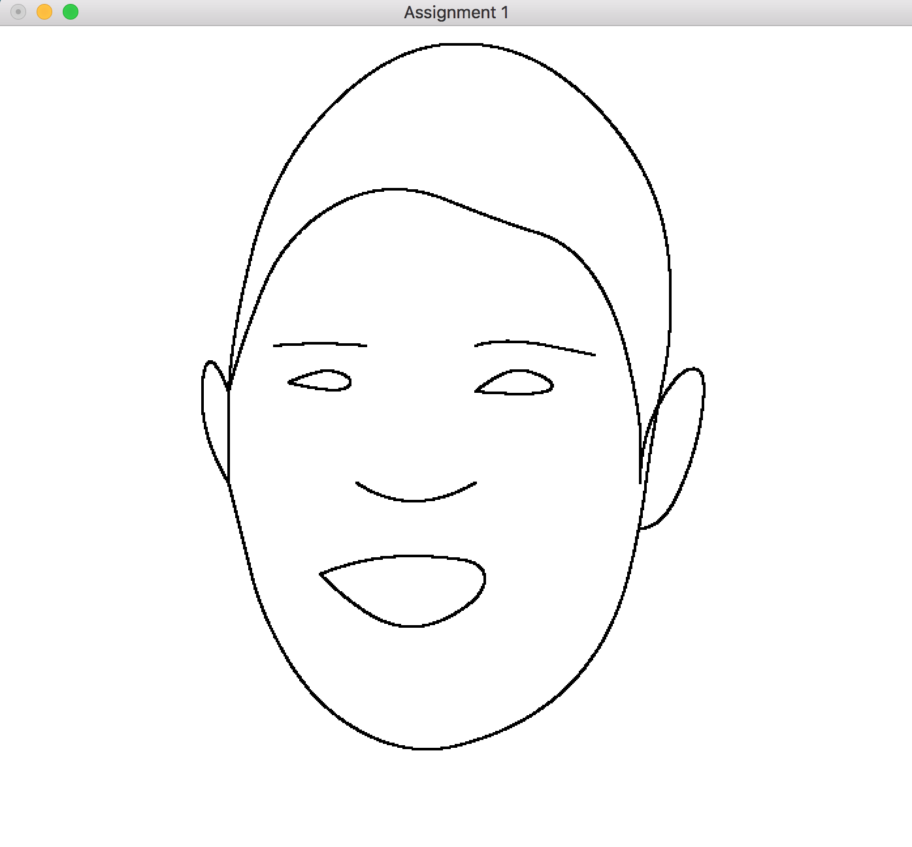
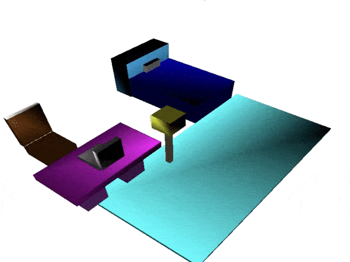

# Graphics
Coursework from CMSI 371: Graphics completed at LMU

# Assignment #1: Cartoonify
I used Bezier's algorithm to draw multiple curves that will form an image. A user is able to input points that will be used in the algorithm to transform points to a line and finally, into a curve. I inputted points for an image of Baby Yoda I found online, and found that Bezier's curve algorithm rendered the points better than Chaikin's algorithm would have, since Chaikin's algorithm does not keep endpoints in its iterations.

Coded in C++ on Xcode using openGL and GLUT frameworks.
Original Image | Final Image
-------|---------------
   | 

# Assignment #2: 3D Model
This assignment uses rotation matrices around the x, y, and z axes as well as a scaling and translation matrix to create objects in a scene. This begins with a rendering of a cube, created by making one plane, and duplicating that plane by rotating and translating to get all six cube faces.

Coded in C++ on Xcode using openGL and GLUT frameworks.

